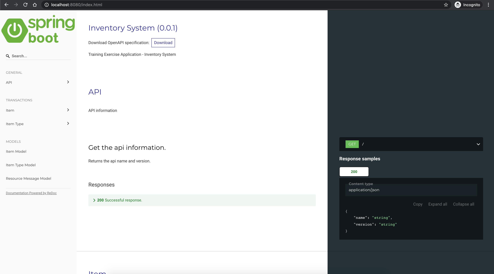
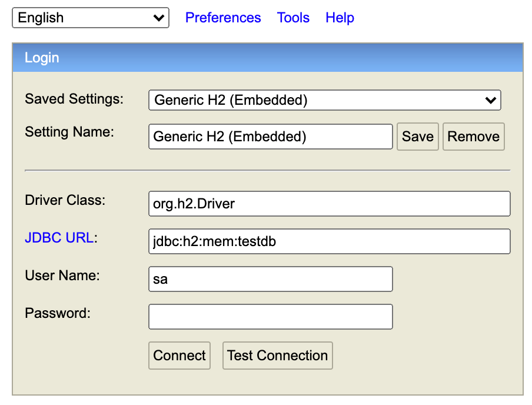
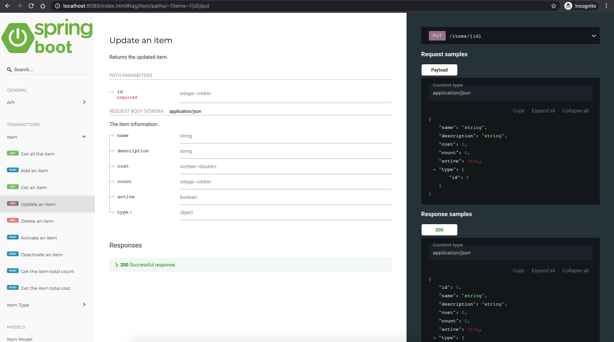

# Springboot - Inventory System #


## Requirements ##
  - JDK 8
  - Gradle

## Getting Started ##
1. To run the application, open a terminal and execute the gradle boot run
```
# Mac|Linux
$ ./gradlew bootRun
```

2. Validate if the api is running
```
$ curl http://localhost:8081
```

3. Transact by calling a valid endpoint.
* See [API Documentation](#api-documentation)
* Example
```
$ curl --location --request GET 'http://localhost:8080/items/types'
```

4. (Optional) View the database.
* _This is used for testing and debugging purposes only_
```
# Open the H2 database console in browser
http://localhost:8080/h2-console

# Set the JDBC url to
jdbc:h2:mem:testdb

# Connect to the database using the default credentials
```


5. Stop the application
```
$ Press Ctrl+C to quit
```

## API Documentation ##
1. Open http://localhost:8080/index.html in browser


## References ##
### OpenAPI Specification ###
* see [api.yaml](src/main/api/api.yaml)

### Other Libraries Used ###
Thymeleaf Template Engine
* https://www.thymeleaf.org/

OpenAPI specification HTML generator (redoc-cli)
* https://github.com/Redocly/redoc
* https://github.com/Redocly/redoc/blob/master/cli/README.md
```
# Installation
npm install -g redoc-cli

# Usage
redoc-cli bundle -o index.html api.yaml
```
